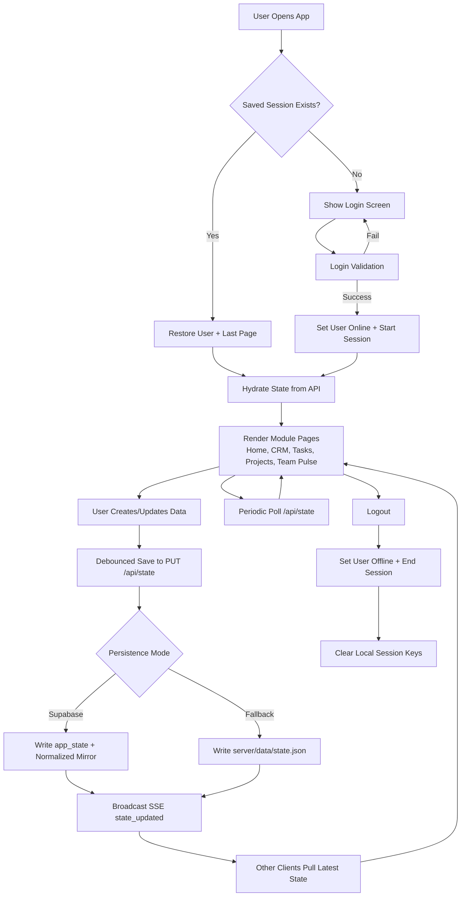

# Surya OS 🌞

**Internal Team Intelligence Platform for SuryaSetu Energy Solutions**

> Building the future of solar energy management in Pune, India | AIC-MIT ADT Incubated Startup

---

## 🚀 About This Software

**Surya OS** is a comprehensive internal team management and intelligence platform designed specifically for **startups building innovative solutions**. In today's rapidly evolving tech landscape, **AI is growing exponentially**, and we at SuryaSetu Energy Solutions are committed to **using AI efficiently** to maximize productivity and drive sustainable energy solutions.

### Why Surya OS?

- **Built for Startups**: Lightweight, fast, and designed for agile teams
- **AI-Powered Efficiency**: Leveraging AI to streamline operations and decision-making
- **Single-File Architecture**: Clean, maintainable React application
- **Real-Time Collaboration**: Keep your team aligned and productive

---

## ✨ Features

### 📊 Dashboard & Analytics
- Real-time team performance metrics
- Project progress tracking
- Revenue and growth analytics

### 👥 Team Management
- Employee directory with roles and skills
- Attendance and leave tracking
- Performance reviews and ratings

### 📋 Project Management
- Project lifecycle management
- Task assignment and tracking
- Milestone monitoring

### 💰 Financial Tracking
- Revenue monitoring
- Expense management
- Budget planning

### 📄 Document Management
- Centralized document storage
- Version control
- Easy sharing

### 🎯 Goals & OKRs
- Company-wide objectives
- Key results tracking
- Progress visualization

### 📅 Calendar & Events
- Team calendar
- Meeting scheduling
- Event management

### 💬 Internal Communication
- Announcements board
- Team messaging
- Notifications system

### ⚙️ Settings & Administration
- User management
- System configuration
- Security settings

---

## 🛠️ Tech Stack

- **Frontend**: React 18.2.0 with Hooks
- **Backend**: Node.js + Express API
- **Build Tool**: Vite 5.4.21
- **Icons**: Lucide React
- **Styling**: Custom CSS with CSS Variables
- **Database**: Supabase (PostgreSQL)
- **Fallback Persistence**: Local JSON storage (`server/data/state.json`) when Supabase env is not configured
- **Architecture**: Full-stack (React SPA + REST API)

---

## 🔄 Working Flowchart



---

## 🚀 Getting Started

### Prerequisites
- Node.js (v16 or higher)
- npm or yarn

### Installation

```bash
# Clone the repository
git clone https://github.com/YOUR_USERNAME/surya-os.git

# Navigate to project directory
cd surya-os

# Install dependencies
npm install

# Create environment file
cp .env.example .env

# Add your Supabase URL + service role key in .env

# Run SQL in Supabase SQL Editor
# File: supabase/schema.sql

# Start full-stack development (frontend + backend)
npm run dev:full

# Or run individually
npm run server
npm run dev
```

The app will be available at `http://localhost:3000`

Backend API runs at `http://localhost:4000` with:
- `GET /api/health`
- `GET /api/state`
- `PUT /api/state`

### Supabase Setup

1. Create a new Supabase project.
2. Open SQL Editor and run [supabase/schema.sql](supabase/schema.sql).
3. Copy values from `.env.example` into `.env` and set:
  - `SUPABASE_URL`
  - `SUPABASE_SERVICE_ROLE_KEY`
4. Start the app with `npm run dev:full`.

When Supabase is configured, API persistence mode is `supabase`.
If not configured, API falls back to local file storage.

### Production Run

```bash
# Build frontend assets
npm run build

# Start backend + serve built frontend
npm start
```

### Default Login Credentials

| Username | Role | Password |
|----------|------|----------|
| onkar | Founder & CEO | solar123 |
| riya | CTO | solar123 |
| aman | Lead Developer | solar123 |
| priya | HR Manager | solar123 |
| dr.desai | Technical Advisor | solar123 |

---

## 🌍 About SuryaSetu Energy Solutions

**SuryaSetu Energy Solutions** is a Pune-based solar energy startup incubated at **AIC-MIT ADT**. We are dedicated to making solar energy accessible and efficient for everyone.

### Our Mission
To accelerate India's transition to sustainable energy through innovative solar solutions and smart technology.

### Our Vision
A future where clean, renewable energy powers every home and business. p2p engry traing and community solar

---

## 🤖 AI & Innovation

At SuryaSetu, we believe in the transformative power of AI:

- **Process Automation**: AI helps us automate repetitive tasks
- **Data-Driven Decisions**: Analytics and insights powered by AI
- **Efficient Resource Allocation**: Smart scheduling and planning
- **Continuous Learning**: AI-assisted knowledge management

> *"AI is not just a tool; it's a partner in building the future."*

---

## 📜 License

This project is proprietary software of SuryaSetu Energy Solutions Pvt. Ltd.

---

## 📞 Contact

**SuryaSetu Energy Solutions**
- 📍 AIC-MIT ADT, Pune, Maharashtra, India
- 🌐 Website: [Coming Soon]
- 📧 Email: contact@suryasetu.com

---

<p align="center">
  <strong>Built with ❤️ by SuryaSetu Team</strong><br>
  <em>Powering Tomorrow, Today</em>
</p>
